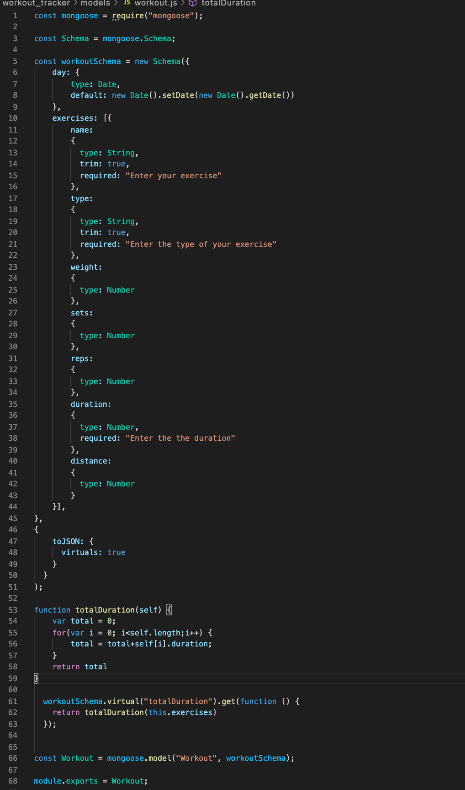
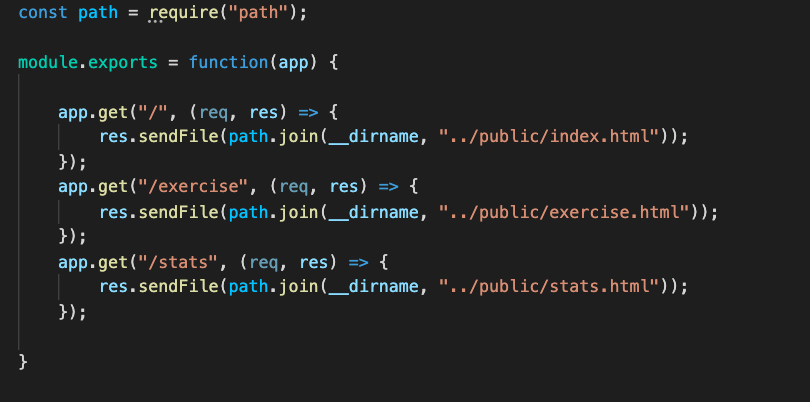
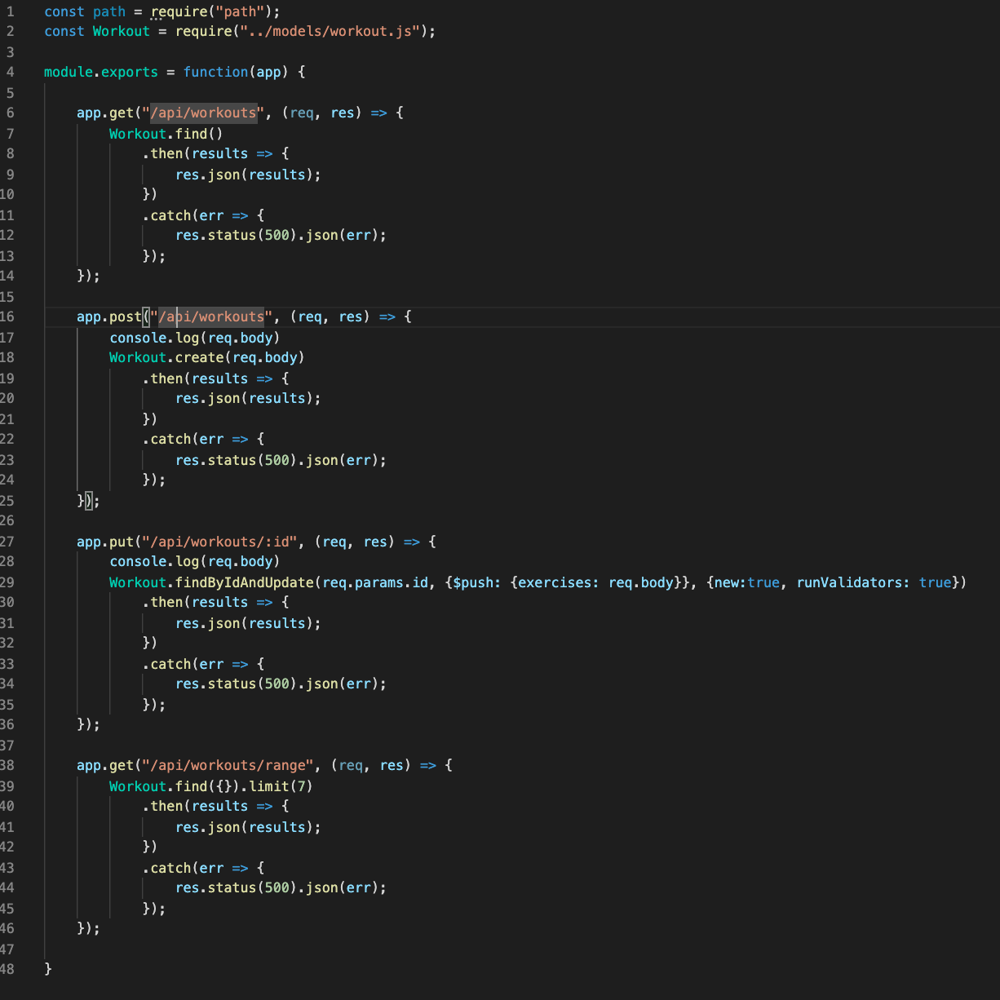
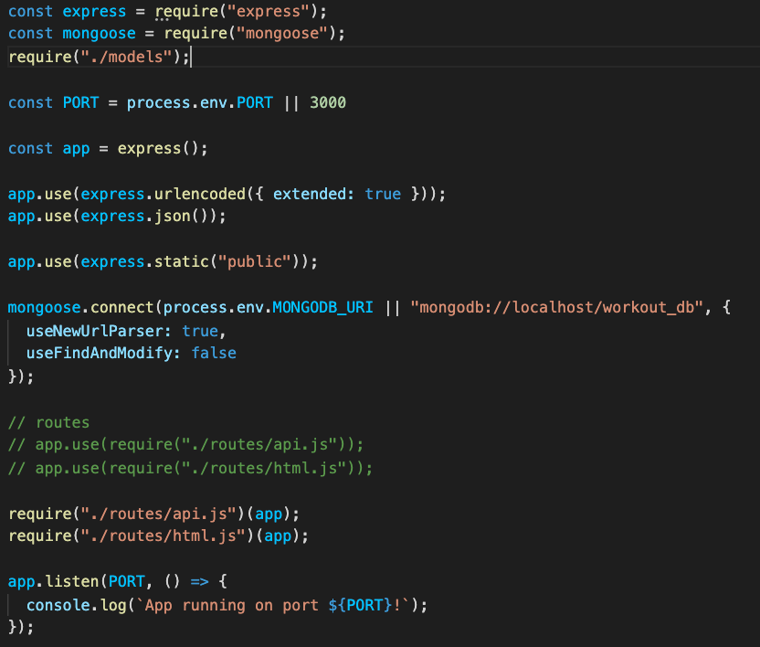
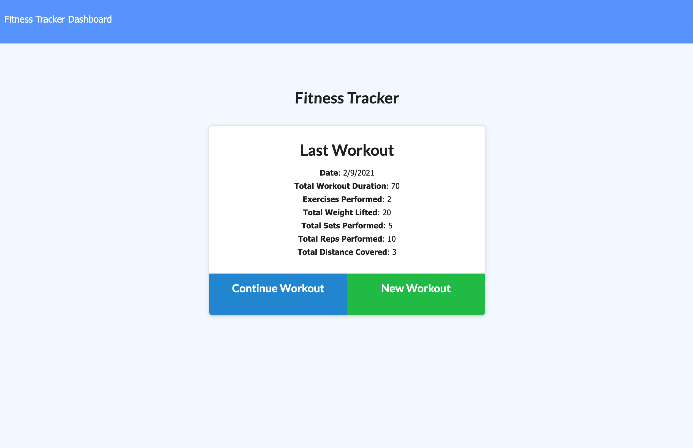
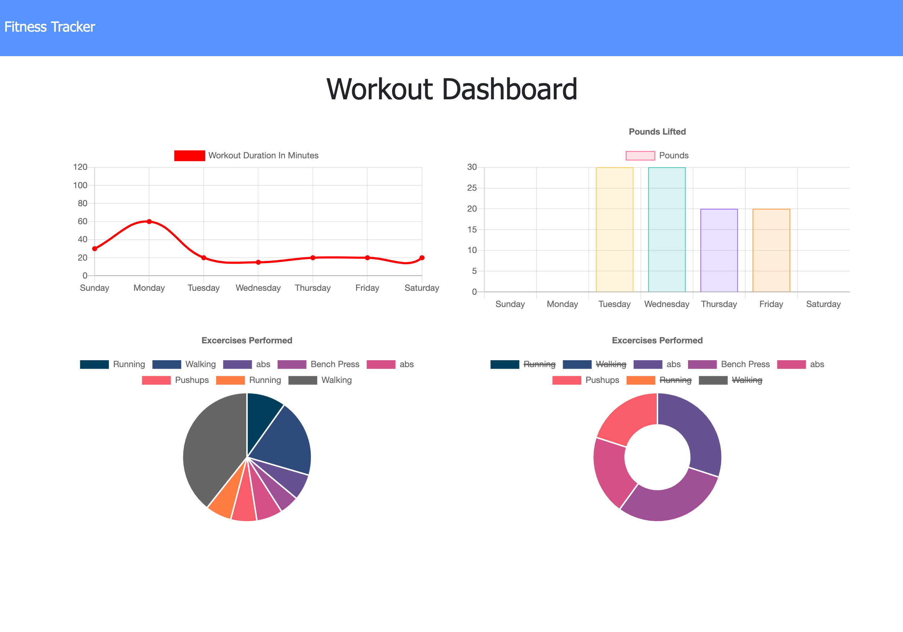

# Workout Tracker 

## Table of Contents
1. [ Description ](#desc)
2. [ Task ](#task)
3. [ Link to Heroku deployment ](#link)
4. [ Structure ](#structure)
5. [ Finished product ](#final)

## 1. Description
This is a full-stack application to view, create and track daily workouts. Developed using MongoDB for backend and JS for frontend. The application is deployed to Heroku using MongoDB Atlas.

## 2. Task
Task is to build a workout tracker that allows user to view, create and track daily workouts.
The app contains three main routes: GET - to allow the user to view their workouts , POST - to allow the user to create a new workout, PUT - to allow the user to add new excersices to the existing workout. There is also an additional GET route that allows the user to view the specific range of their workouts. 

## 3. Link to Heroku deployment 
The project is deployed on Heroku and available for view using this link:
https://workout-tracker-kat.herokuapp.com/

## 4. Structure
The repo contains a set of files and folders responsible for backend functionality. Files responsible for frontend functionality are located in a public folder.

Models folder contains *workout.js* which initializes the documents saved to the database:
.
Routes folder contains *html.js* which sets the routes to display .html files:

and *api.js* which is responsible for displaying and posting the data to the database. 
.
*Server.js* that is located in the root folder stores all the dependensies and connects to the port.
.

## 5. Finished product
The final HTML page looks like this:

